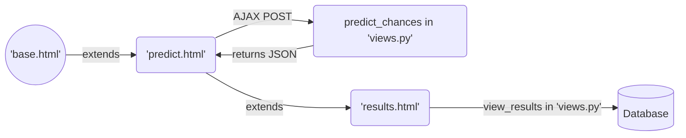
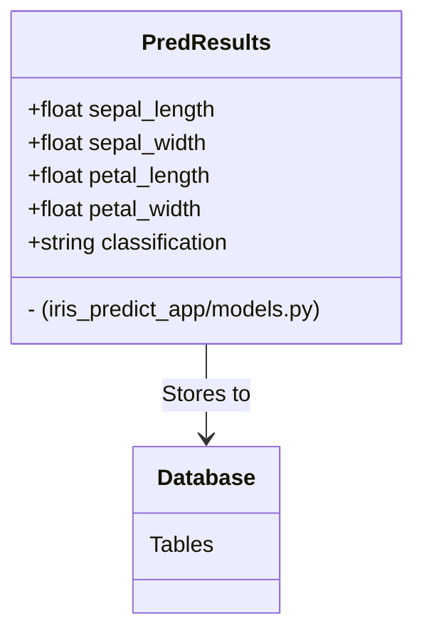
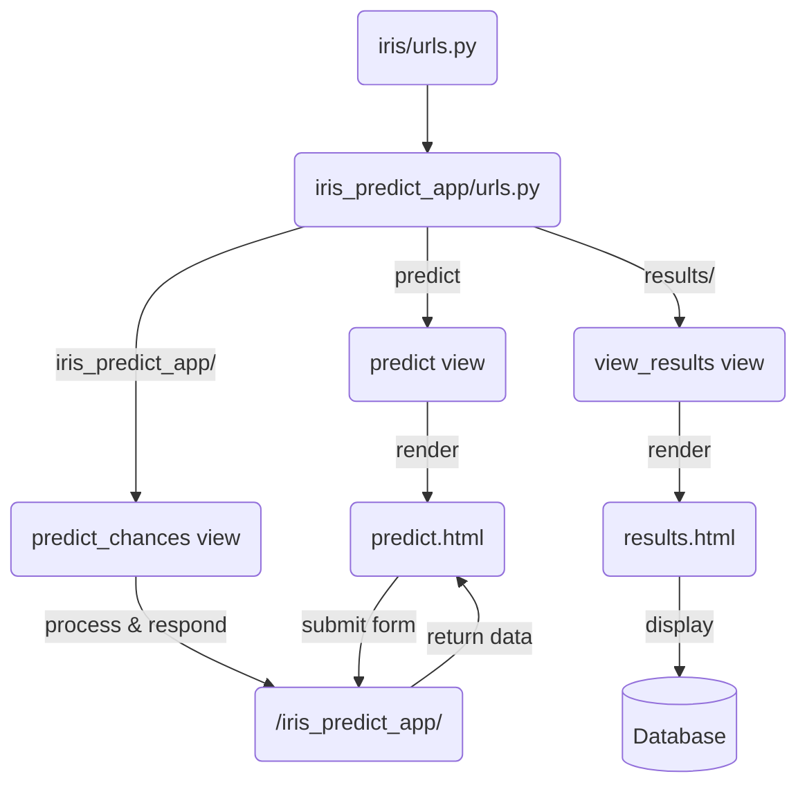

# Iris Prediction Web App using Scikit-learn and Django

## Introduction 

A simple project to practice building a web app using Django framework to predict Iris flower.

## Introduction to the Iris dataset

This data sets consists of 3 different types of irises’ (Setosa, Versicolour, and Virginica) petal and sepal length, stored in a 150x4 numpy.ndarray.

The rows being the samples and the columns being: Sepal Length, Sepal Width, Petal Length and Petal Width.

Read more about the Iris dataset [here](https://archive.ics.uci.edu/dataset/53/iris).

## How to install the dependencies

```bash
$ pipenv install --dev
```

## Machine learning model

I choose the **Support Vector Classification (SVC)** model since it's one of the models yielding the best accuracy and precision compared to other methods.

### Template Flow and Interaction



### Models and Database



### Views and URL Configuration

