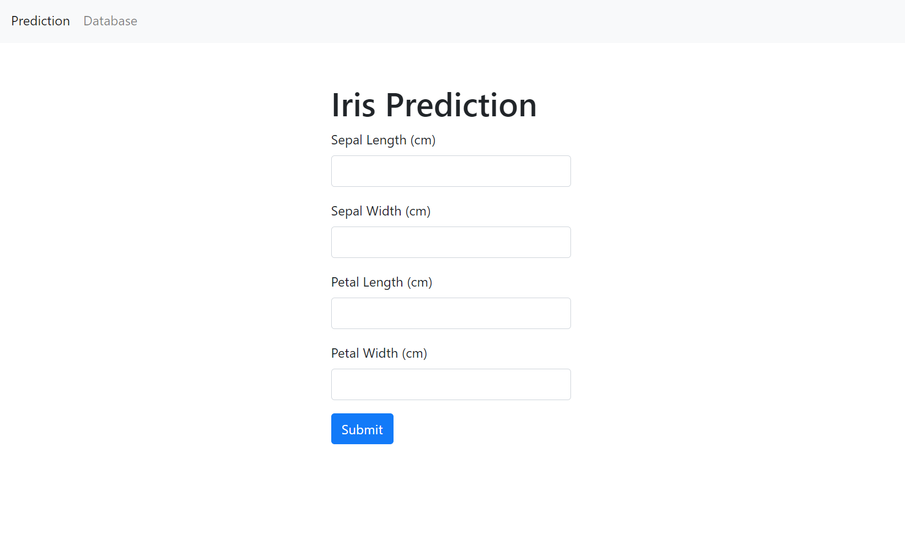

# Iris Prediction Web App using Scikit-learn and Django



## Introduction

This is a simple project to practice building a web app to predict Iris flower based on its characteristics (petal, sepal lengths, etc.). I used Support Vector Machines (SVM) model to train the samples and make predictions. Then, I built an interactive web-based application using Django framework. Users can enter the input values and the app backend will make predictions based on the trained model and respond with the prediction results.

## Features

- Interactive input form: Users can enter the input values of iris flower's characteristics to the form.
- Fast prediction feedback: The backend pre-trained model predicts and responds with the results of the iris flower name.
- Historical results view: Users or admins can review the past prediction results in the Database.

## Installation

Here is how you can start using the app on your own computer:

### Step 1: Setting up a virtual environment

I've used `pipenv` for this project. If you have not installed `pipenv` yet, run the following command in your terminal or command prompt:

```bash
pip install pipenv
```

Or if you just want to use the traditional virtual environment setup, run the command:

```bash
python -m venv venv
```

### Step 2: Cloning the repository

Enter the script in the terminal:

```bash
git clone https://github.com/longnca/iris-prediction-django-web-app.git
``` 

Then, go to the project's directory where the `Pipfile` and `Pipfile.lock` are located.

### Step 3: Installing dependencies using pipenv

Now, you're ready to set up your environment. Run the following command:

```bash
pipenv install --ignore-pipfile
```

This ensures that you are installing the exact versions of the dependencies that I used.

However, if you want to install dependencies based on the Pipfile and update the Pipfile.lock accordingly, use this instead:

```bash
pipenv install
```

If you do not use `pipenv`, then run this command to install the dependencies listed in the `requirements.txt` (it's actually extracted from my pipfile):

```bash
pip install -r requirements.txt
```

### Step 4: Activate the virtual environment 

Run this command:

```bash
pipenv shell
```

Then, verify that the correct dependencies are installed by running `pip list` or `pipenv graph`.