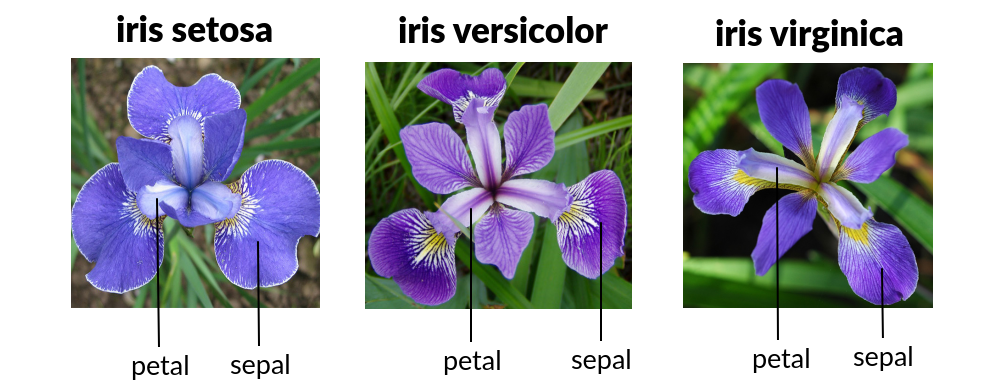

# Iris Prediction Web App using Django


## Introduction

This is a simple project to practice building a web app to predict Iris flowers based on their characteristics (petal, sepal lengths, etc.). I used a Support Vector Machine (SVM) model to train the samples and make predictions. Then, I built an interactive web-based application using the Django framework. Users can enter the input values, and the app backend will make predictions based on the trained model and respond with the prediction results.

## Features

- Interactive input form: Users can enter the input values of iris flower's characteristics to the form.
- Fast prediction feedback: The backend pre-trained model predicts and responds with the results of the iris flower name.
- Historical results view: Users or admins can review the past prediction results in the Database.

## Installation

Here is how you can start using the app on your own computer:

### Step 1: Setting up a virtual environment

I've used `pipenv` for this project. If you have not installed `pipenv` yet, run the following command in your terminal or command prompt:

```bash
pip install pipenv
```

Or if you just want to use the traditional virtual environment setup, run the command:

```bash
python -m venv venv
```

### Step 2: Cloning the repository

Enter the script in the terminal:

```bash
git clone https://github.com/longnca/iris-prediction-django-web-app.git
``` 

Then, go to the project's directory where the `Pipfile` and `Pipfile.lock` are located.

### Step 3: Installing dependencies using pipenv

Now, you're ready to set up your environment. Run the following command:

```bash
pipenv install --ignore-pipfile
```

This ensures that you install the exact versions of the dependencies I used.

However, if you want to install dependencies based on the Pipfile and update the Pipfile.lock accordingly, use this instead:

```bash
pipenv install
```

If you do not use `pipenv`, then run this command to install the dependencies listed in the `requirements.txt`, which is actually extracted from my pipfile:

```bash
pip install -r requirements.txt
```

### Step 4: Activate the virtual environment 

Run this command:

```bash
pipenv shell
```

Then, verify that the correct dependencies are installed by running `pip list` or `pipenv graph`.

## Usage

### Start Django server

After activating the virtual environment, go to the directory of the GitHub repository that you cloned. In the terminal, use the following command:

```bash
python manage.py runserver
```

You should see the following return:


Then, you can Ctrl + click on the link: `http://127.0.0.1:8000/` or head over to your browser, go to `http://127.0.0.1:8000/` or `http://localhost:8000/`. You should see the following frontpage.


### Use the prediction web app

From the frontend of the web app, you can:
- Input data for each field with the precision up to 0.1 decimal points.


- View the predicted result.


- View the historical prediction results.


## Data



This data set consists of the petal and sepal length/width measurements of iris flowers. There are three different types of irises (Setosa, Versicolour, and Virginica) as the target variable for the machine learning model.

The dataset is a CSV file that contains 150 records under 5 attributes: Petal Length, Petal Width, Sepal Length, Sepal width, and Class(Species).

Read more about the Iris dataset [here](https://archive.ics.uci.edu/dataset/53/iris).

## Models

I used the **Support Vector Machines (SVM)** model since it's effective for classification problems and yields the best accuracy and precision compared to other methods based on UCI's website.

## Technical Details

This section briefly describes the structure of the Iris Flower Prediction App. I will introduce the Django MVT (Model-View-Template) architecture and the flow of data through the system.

### Django MVT architecture

Django uses the MVT (Model-View-Template) framework. This framework separates the logic of different application components. This helps increase the modularity concept, which is good for reproducibility, scalability, and maintainability.

#### 1. Model (`models.py`)

In this app, there is one class `PredResults` for the model. The class defines the structure of the database that stores the prediction results. Each field corresponds to a column in the database and the classification result.

#### 2. View (`views.py`)

Views are the classes that receive requests from users and return the prediction responses. This app has three classes (views): `predict`, `predict_chances`, and `view_results`. Each view handles a different logic:

- `predict`: processes the submission from the input form.
- `predict_chances`: makes the prediction using the pre-trained ML model (the pickle file) and stores the results in the database.
- `view_results`: shows the database of past results.

#### 3. Template (`templates/`)

The folder `iris_predict_app/templates/` contains HTML files which show the front-end interface. This app uses two templates, `predict.html` and `results.html` to render the user interface.

- `predict.html`: shows the front-end of the app.
- `results.html`: shows the tables of results in the database.

### Data flow

The diagram below illustrates the flow of data through the system.


1. User interaction: The flow begins when users navigate to the Iris Prediction form (shown by `predict.html` file). Users can input values in the fields.
1. Form submission: When users submit the form, the data is sent to the `predict_chances` view in `views.py` file. This view processes the data using the ML model (saved in pickle format) and returns the classification result. Then, the data is stored in the database by using the `PredResults` model in `models.py`.
1. Result display: The view sends a response back to the users on `predict.html` file. Users can also go to **Database** (`results.html` page) to view all past prediction results stored in the database.

## Next Steps

In the future, there are some tasks that I think I can improve on the project:

- Improve the styling of the app.
- Deploy the project to a cloud platform like AWS or Azure.
- Add images of Iris flowers in the results.
- Add a retrain capability.

## Contributing

I welcome contributions, feedback, and suggestions! Please feel free to fork the project, open pull requests/issues, or contact me with your ideas.

## Credits

- VeryAcademy’s YouTube tutorial. I’ve modified some parts of the original project by VeryAcademy, such as styling the app, minor changes to SVM modelling and HTML files, unit testing, etc.
- Book: Python Crash Course 3rd Edition by Eric Matthes.

## License

MIT license.
